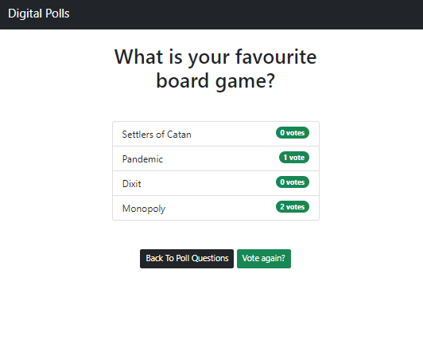

# DigiPolls

**Python | Django | PyTest**

To improve my Python skills and try out the Django framework, I'm working on a simple polling app.

### To run the app

1. Install dependencies listed in the Pipfile with pip or pipenv
   `pipenv install`
2. Change into mypoll directory and run the server:

```
cd mypoll
python3 manage.py runserver
```

3. Get polling!




### Notes to self

- pipenv shell to launch the virtual environment. Or, if it was already created, use CTRL+SHIFT+P to make sure the right interpreter is selected i.e. python-project.....
